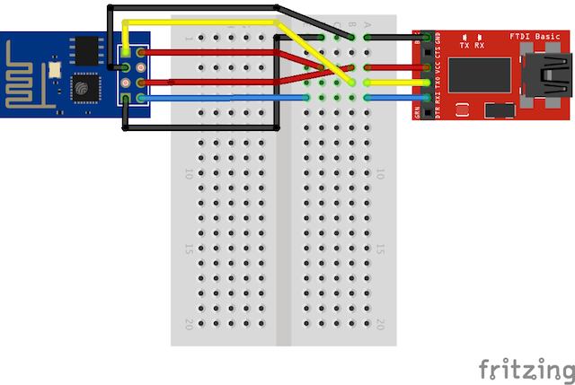
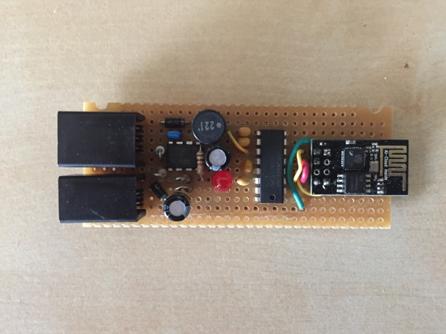
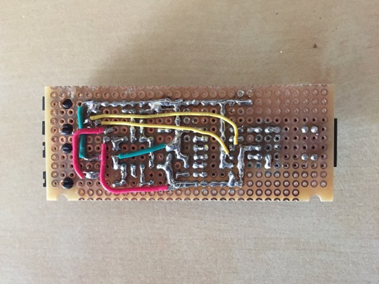
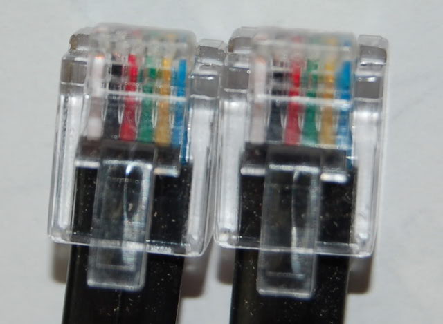
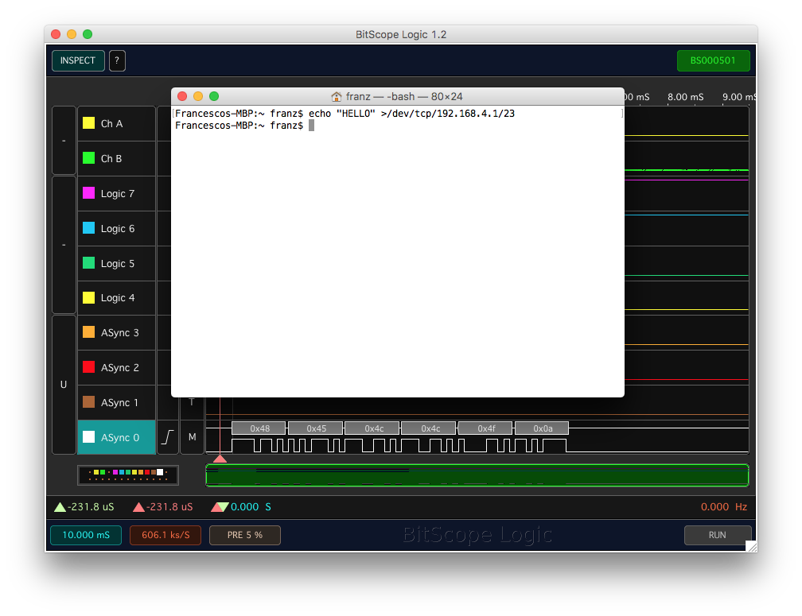

#Wi-Fi to RS-232 bridge for iOptron iEQ Pro mounts

An ESP8266 and [esp-link](https://github.com/jeelabs/esp-link)-based Wi-Fi to RS-232 bridge to allow TCP wireless control of an iOptron iEQ Pro mount (tested on iEQ45 Pro, should also work on iEQ30 Pro).

[Here](https://www.youtube.com/watch?v=_uhQ0Lzc3-E) you can find a video of the operation an iEQ45 Pro mount with this circuit and the commercial Sky Safari app.

##Features
* Uses an inexpensive ESP8266 ESP-01 module
* Uses the well tested [esp-link](https://github.com/jeelabs/esp-link) open source firmware to implement a transparent TCP-to-serial bridge
* Powered directly from the mount, via the iOptron port, with an efficient 3.3V DC-to-DC converter based on the MC34063 switch-mode converter
* RS-232 compatibility ensured by a MAX3232 driver/receiver
* Easy to build, with through-hole parts and protoboard-friendly design

##Disclaimer
This project comes with no warranty. The project files may contain mistakes and errors. If you build this circuit, it is solely your responsibility to make sure that it doesn't damage your mount or other equipment, and doesn't hurt you or other people. Test all voltages and polarities before making any connections. By building the circuit you accept that I will have no liability whatsoever for damages or injuries that you or other parties may incur in during the building process or during the operation of the circuit. Builder assumes all risks. Don't build this circuit if you don't agree!

##Building instructions
### 1. Flash the ESP-01 module
The ESP-01 module must be flashed with the esp-link firmware. I have tested version 2.2.3 and it works well.
In order to flash the module, I recommend following the instructions present on the [release page](https://github.com/jeelabs/esp-link/releases) of the esp-link GitHub repository. Remember to enable flash programming mode by tying GPIO0 to ground and rebooting the module, before trying to upload the firmware code. The following is a schematic of how one should connect the ESP-01 module to a FTDI232 3.3V breakout board like the one sold by Sparkfun:

### 2. Configure the esp-link bridge
After the flashing is successful, a new Wi-Fi network with name "ESP_xxxx" should be visible. After connecting to that network, point your browser to http://192.168.4.1. If everything works fine, the browser should show the esp-link web interface. There are two simple configuration steps to do:

1. Configure the serial port to 9600 bps, 8 data bits, 1 stop bit, no parity (9600 8N1)
2. Disable the UART debug log

### 3. Build the circuit
The EAGLE board file is easy to follow and transfer to a protoboard. The "traces" on the bottom layer are meant to be solder bridges between adjacent copper pads of the protoboard, whereas the air wires are meant to be real jumper wires. When the wire connects directly to a part lead, it is meant to be routed on the bottom of the board. When there are vias, the idea is that the wire can be routed on the top of the board, but of course that's just a suggestion.

*A prototype of this circuit.*
##Usage
###Connection
To connect the circuit to the mount, you need to use two cords: 
* a "straight" 6P6C cord to connect the circuit to the iOptron port on the mount (for 12V power)
* a "straight" 4P4C cord to connect the circuit to the RS-232 port on the mount

"Straight" cords are cords in which the order of the colors of the inner wires is the same if you look at both plugs (when observed from the same side). The coiled cords that came with the mount came are straight cords:

*A 6P6C straight cord*
###Power it up
The bridge draws power directly from the mount. When the mount is powered up, the board is also energized and the LED should light up.
###Test it
If you have a digital mixed-signal oscilloscope, you can test if the board works properly by capturing the output of the RXD pin of the RS-232 port while connected to the ESP8266 Wi-Fi AP and while sending a string to the TCP port 23 of the ESP8266 IP address (by default, 192.168.4.1). Here is a sample screenshot of the output of a USB logic analyzer while sending the string "HELLO" (ASCII 0x48 0x45 0x4C 0x4C 0x4F plus a 0x0A newline) to the bridge board:

###Enjoy!
Point your favorite telescope control software to 192.168.4.1, port 23, and enjoy wireless telescope control!